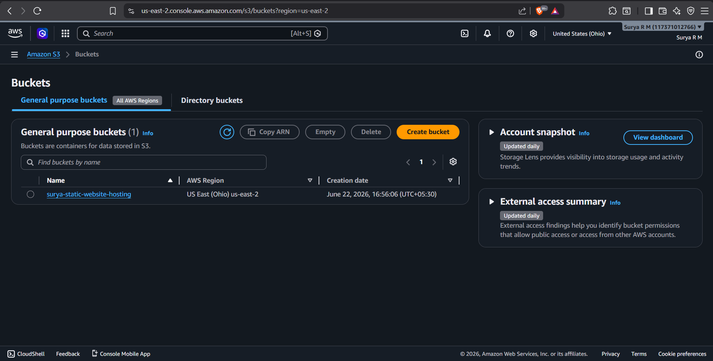
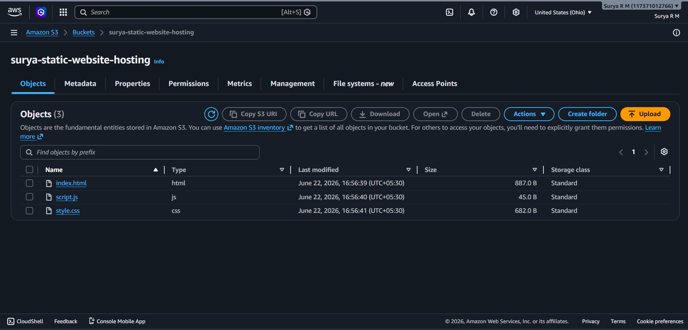
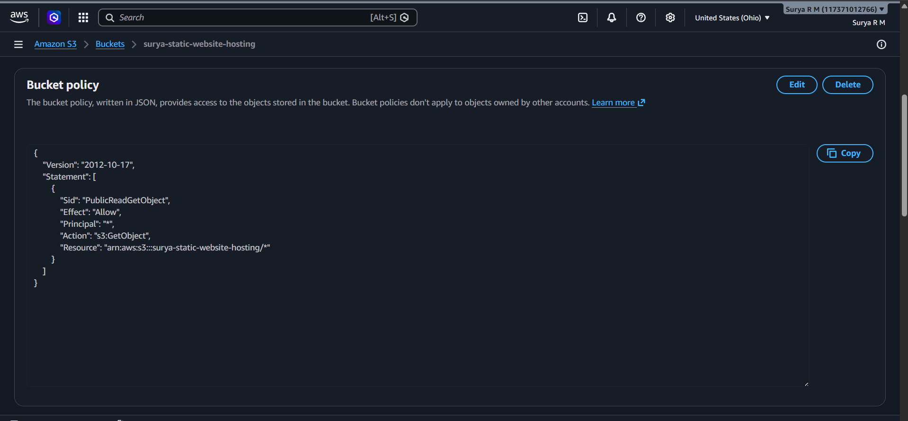
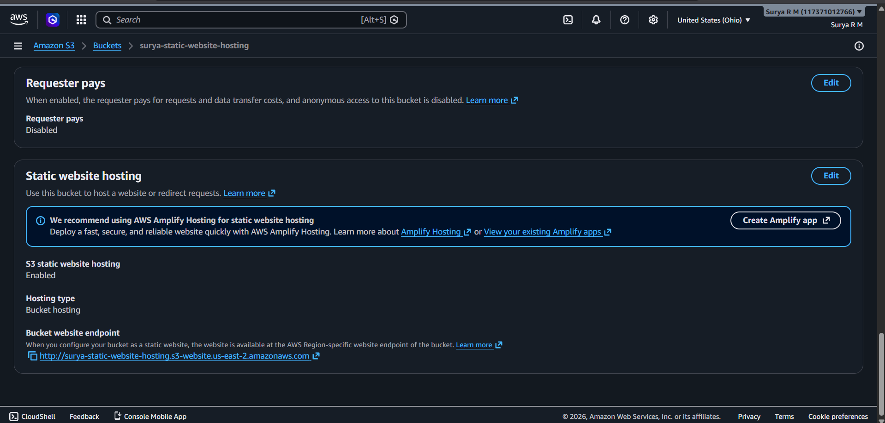
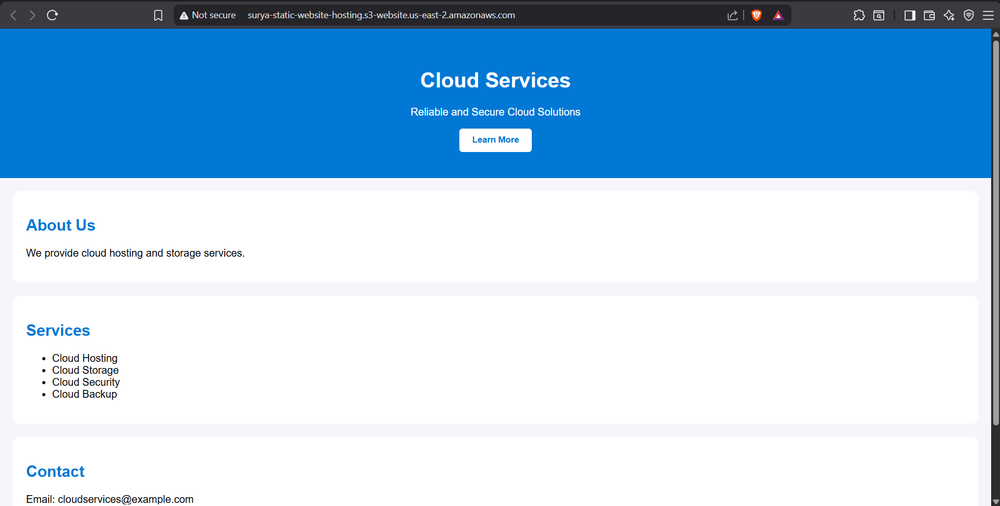

#INTERN DETAILS 
   NAME : SURYA R M

   
   INTERN_ID : CITS4229
# AWS Static Website Hosting

## Objective
To host a static website on Amazon S3 and make it accessible through the internet using S3 Static Website Hosting.

## Services Used
- Amazon S3
- GitHub

## Project Files
- index.html
- style.css
- script.js

## Implementation Steps

### 1. Created GitHub Repository
Uploaded the website source files to GitHub.

### 2. Created S3 Bucket
Created a bucket named:
surya-static-website-hosting

### 3. Uploaded Website Files
Uploaded HTML, CSS and JavaScript files into the bucket.

### 4. Configured Permissions
- Disabled Block Public Access
- Added Bucket Policy for public read access

### 5. Enabled Static Website Hosting
Configured:
- Index document: index.html

### 6. Accessed Website
Used the S3 Website Endpoint to access the website publicly.

## Screenshots

### S3 Bucket Creation

### Uploaded Objects

### Bucket Policy

### Static Website Hosting

### Live Website

## Result
Successfully deployed a static website using Amazon S3 and made it publicly accessible through the S3 website endpoint.
